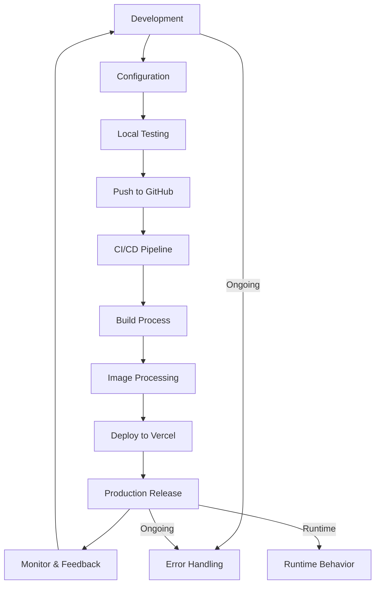

# Preact Responsive Image Project

This project demonstrates a production-ready Preact application with advanced responsive image handling. It includes optimizations, best practices, and features suitable for a production environment.

[](https://vercel.com/new/clone?repository-url=https://github.com/yourusername/preact-responsive-image-project)

## Table of Contents

- [Features](#features)
- [Project Structure](#project-structure)
- [Prerequisites](#prerequisites)
- [Setup Instructions](#setup-instructions)
- [Usage](#usage)
- [How It Works](#how-it-works)
- [Project Lifecycle](#project-lifecycle)
- [Configuration Files](#configuration-files)
- [Scripts](#scripts)
- [Deployment](#deployment)
- [Environment Variables](#environment-variables)
- [Troubleshooting](#troubleshooting)
- [Performance Considerations](#performance-considerations)
- [Browser Support](#browser-support)
- [Customization](#customization)
- [Contributing](#contributing)
- [License](#license)
- [Acknowledgments](#acknowledgments)

## Features

- Responsive image loading with WebP support and fallbacks
- Intelligent handling of images with alpha channels
- Webpack configuration for development and production
- Code splitting and performance optimizations
- Environment-specific configurations
- Testing setup with Jest
- Linting and formatting with ESLint and Prettier
- Continuous Integration/Continuous Deployment (CI/CD) setup
- Error boundaries for robust error handling

## Project Structure

```
project-root/
├── src/
│   ├── components/
│   │   ├── ResponsiveImage/
│   │   │   └── ResponsiveImage.js
│   │   └── App/
│   │       └── App.js
│   ├── styles/
│   │   └── global.css
│   ├── index.js
│   └── index.html
├── public/
│   └── images/
│       └── example.png
├── config/
│   ├── webpack.common.js
│   ├── webpack.dev.js
│   └── webpack.prod.js
├── package.json
├── vercel.json
├── .gitignore
├── .env.example
├── .eslintrc.js
├── jest.config.js
├── .prettierrc
└── README.md
```

## Prerequisites

Before you begin, ensure you have the following installed:
- Node.js (version 14 or later)
- npm (usually comes with Node.js)
- Git

## Setup Instructions

1. Clone the repository:
   ```
   git clone https://github.com/yourusername/preact-responsive-image-project.git
   cd preact-responsive-image-project
   ```

2. Install dependencies:
   ```
   npm install
   ```

3. Set up environment variables:
   - Copy `.env.example` to `.env.development` and `.env.production`
   - Edit both files and replace the placeholder values with your actual configuration

4. Place your source PNG images in the `public/images/` directory.

5. Start the development server:
   ```
   npm start
   ```

6. For production build:
   ```
   npm run build
   ```

## Usage

To use the ResponsiveImage component in your Preact application:

```jsx
import ResponsiveImage from './components/ResponsiveImage/ResponsiveImage';

const MyComponent = () => (
  <ResponsiveImage
    src="example.png"
    alt="An example image"
    sizes="(max-width: 600px) 300px, (max-width: 1200px) 600px, 1200px"
  />
);
```

## How It Works

1. During the build process:
   - WebP versions are generated for all images.
   - PNG versions are generated only for images with an alpha channel.
   - JPEG versions are generated for images without an alpha channel.
   - Metadata JSON files are created for each image, storing information about the alpha channel.

2. The ResponsiveImage component:
   - Fetches the metadata for the image.
   - Sets up the appropriate `srcSet` for WebP and fallback images.
   - Uses an `img` tag with `srcSet` to provide both WebP and fallback versions, allowing the browser to choose the best format.

3. Error handling:
   - The component includes error handling for both image and metadata loading failures.
   - An ErrorBoundary component in App.js catches any errors that occur during rendering.

## Project Lifecycle

The following flowchart illustrates the lifecycle of the Preact Responsive Image Project:



This diagram shows the main stages of the development and deployment process, including configuration, testing, CI/CD, image processing, and ongoing activities like error handling and monitoring.

## Configuration Files

### .eslintrc.js
```javascript
module.exports = {
  env: {
    browser: true,
    es2021: true,
    node: true,
    jest: true,
  },
  extends: [
    'eslint:recommended',
    'plugin:preact/recommended',
  ],
  parserOptions: {
    ecmaVersion: 12,
    sourceType: 'module',
  },
  rules: {
    // Add custom rules here
  },
};
```

### jest.config.js
```javascript
module.exports = {
  testEnvironment: 'jsdom',
  transform: {
    '^.+\\.js$': 'babel-jest',
  },
  moduleNameMapper: {
    '\\.(css|less|scss|sass)$': 'identity-obj-proxy',
  },
  setupFilesAfterEnv: ['<rootDir>/src/setupTests.js'],
};
```

### .prettierrc
```json
{
  "singleQuote": true,
  "trailingComma": "es5",
  "tabWidth": 2,
  "semi": true,
  "printWidth": 100
}
```

## Scripts

- `npm start`: Start development server
- `npm run build`: Build for production
- `npm test`: Run tests
- `npm run lint`: Lint code
- `npm run format`: Format code

## Deployment

### Quick Deploy with Vercel

Click the "Deploy with Vercel" button at the top of this README to deploy the project quickly with Vercel.

### Manual Deployment

This project is set up for deployment on Vercel. To deploy manually:

1. Install Vercel CLI: `npm i -g vercel`
2. Run: `vercel`
3. Follow the prompts to link your project and deploy

## Environment Variables

This project uses environment variables for configuration. The `.env.example` file provides a template with the following variables:

- `APP_NAME`: Name of the application
- `NODE_ENV`: Current environment (development/production)
- `PORT`: Server port number
- `MAX_IMAGE_SIZE`: Maximum allowed image size in bytes
- `ALLOWED_IMAGE_TYPES`: Comma-separated list of allowed image file types
- `VERCEL_API_TOKEN`: API token for Vercel deployments
- `DB_HOST`, `DB_USER`, `DB_PASS`, `DB_NAME`: Database connection details (if applicable)
- `REDIS_URL`: URL for Redis cache (if used)
- `LOG_LEVEL`: Logging level
- `ENABLE_WEBP_CONVERSION`: Feature flag for WebP conversion
- `ENABLE_LAZY_LOADING`: Feature flag for image lazy loading
- `GOOGLE_ANALYTICS_ID`: Google Analytics ID (if used)
- `CDN_URL`: URL for Content Delivery Network (if used)
- `JWT_SECRET`: Secret key for JWT authentication
- `CORS_ORIGIN`: Allowed origin for CORS

Make sure to set these variables in your `.env.development` and `.env.production` files as needed.

## Troubleshooting

If you encounter the error "Failed to load image. Please try again later.", follow these steps:

1. Check Image Existence:
   - Ensure that your source PNG images are in the `public/images/` directory.
   - Verify that the image filename in your code matches exactly with the file in the directory.

2. Build Process:
   - Run `npm run build` and check the console for any error messages during the image processing step.
   - After building, check the `dist/assets/images/` directory to ensure that the processed images and metadata files are generated correctly.

3. Development Server:
   - If using a development server, ensure it's configured to serve the `dist` directory correctly.
   - Check the Network tab in your browser's Developer Tools to see if the image and metadata files are being requested with the correct paths.

4. Metadata Fetch:
   - Open your browser's Developer Tools and go to the Network tab.
   - Look for requests to `.json` files in the `/assets/images/metadata/` directory.
   - If these requests are failing, check your server configuration to ensure these files are being served correctly.

5. Image Paths:
   - Verify that the image paths in your code match the actual file names and directory structure.
   - Example usage:
     ```jsx
     <ResponsiveImage
       src="example.png"
       alt="Example image"
       sizes="(max-width: 600px) 300px, (max-width: 1200px) 600px, 1200px"
     />
     ```

6. CORS Issues:
   - If you're hosting your images on a different domain, ensure that CORS is properly configured on your server.

7. Environment Variables:
   - Check that your environment variables are set correctly, especially any that might affect image processing or serving.

8. Update ResponsiveImage Component:
   - Modify the ResponsiveImage component to provide more detailed error information. Update `src/components/ResponsiveImage/ResponsiveImage.js`:

     ```javascript
     import { h } from 'preact';
     import { useState, useEffect } from 'preact/hooks';

     const ResponsiveImage = ({ src, alt, sizes }) => {
       const [imageMeta, setImageMeta] = useState(null);
       const [error, setError] = useState(null);

       useEffect(() => {
         fetch(`/assets/images/metadata/${src.replace(/\.[^/.]+$/, "")}.json`)
           .then(response => {
             if (!response.ok) {
               throw new Error(`HTTP error! status: ${response.status}`);
             }
             return response.json();
           })
           .then(setImageMeta)
           .catch(err => {
             console.error('Error loading image metadata:', err);
             setError(`Failed to load image metadata: ${err.message}`);
           });
       }, [src]);

       if (error) return <div class="error">{error}</div>;
       if (!imageMeta) return <div class="loading">Loading...</div>;

       const basePath = '/assets/images';
       const webpSrcSet = [300, 600, 1200, 2000]
         .map(size => `${basePath}/webp/${src.replace(/\.[^/.]+$/, "")}-${size}.webp ${size}w`)
         .join(', ');
       
       const fallbackFormat = imageMeta.hasAlpha ? 'png' : 'jpg';
       const fallbackSrcSet = [300, 600, 1200, 2000]
         .map(size => `${basePath}/${fallbackFormat}/${src.replace(/\.[^/.]+$/, "")}-${size}.${fallbackFormat} ${size}w`)
         .join(', ');

       return (
          {
             console.error('Image loading error:', e);
             setError(`Failed to load image: ${e.target.src}`);
           }}
         />
       );
     };

     export default ResponsiveImage;
     ```

9. Verify Webpack Configuration:
   - Double-check your Webpack configuration, especially the part handling image processing.
   - Ensure that the output paths in the Webpack config match the paths you're using in the ResponsiveImage component.

If the issue persists after trying these steps, please open an issue on the GitHub repository with the following information:
- The exact error message you're seeing
- Your Webpack configuration
- The contents of your `public/images/` directory
- Any relevant console or network errors from your browser's Developer Tools

## Performance Considerations

The responsive image approach used in this project offers several performance benefits:
- Reduced bandwidth usage by serving appropriately sized images
- Faster load times, especially on mobile devices
- Improved Core Web Vitals scores

## Browser Support

This project supports modern browsers including:
- Chrome (and Chromium-based browsers) version 60+
- Firefox version 55+
- Safari version 11+
- Edge version 79+

## Customization

To customize the responsive image sizes:
1. Modify the `sizes` array in `config/webpack.common.js`
2. Update the `webpSrcSet` and `fallbackSrcSet` in `src/components/ResponsiveImage/ResponsiveImage.js`

For other customizations, refer to the respective configuration files.

## Contributing

Contributions are welcome! Please feel free to submit a Pull Request.

1. Fork the project
2. Create your feature branch (`git checkout -b feature/AmazingFeature`)
3. Commit your changes (`git commit -m 'Add some AmazingFeature'`)
4. Push to the branch (`git push origin feature/AmazingFeature`)
5. Open a Pull Request

## License

This project is licensed under the MIT License.

## Acknowledgments

- [Preact](https://preactjs.com/) for the lightweight React alternative
- [Sharp](https://sharp.pixelplumbing.com/) for the high-performance image processing
- [Webpack](https://webpack.js.org/) for bundling and build process
- [Vercel](https://vercel.com/) for easy deployment options
